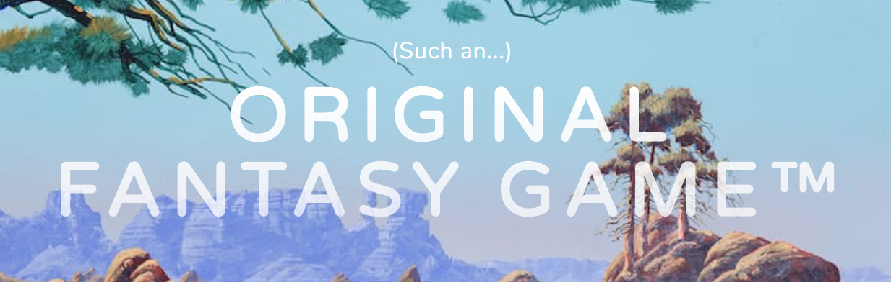
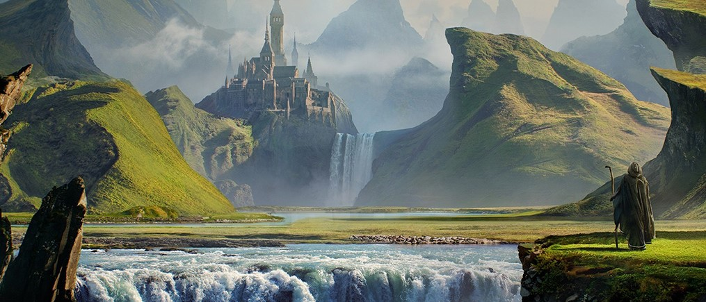

# **ORIGINAL FANTASY GAME&trade;**



## **Introduction**

This is the repository for the **ORIGINAL FANTASY GAME&trade;** website.

The deployed site can be visited by clicking [**here**](https://pq-original-fantasy-game.herokuapp.com/).

The site code can be viewed in this [**GitHub Repository**](https://github.com/an-slua-sidhe/milestone-3).

My name is **Paul Quinn** and I designed and developed this site in its entirety as part of my [**Fullstack Web Development Diploma**](https://codeinstitut#e.net/courses) with the **Code Institute**, Ireland. For my Milestone 3 project, I designed a browser-based adventure game called the 'Original Fantasy Game™'. The inspiration for this came from the [**Fighting Fantasy**](https://en.wikipedia.org/wiki/Fighting_Fantasy) series of books by Games Workshop in the 1980s (among others). I imagined each page choice in the books as equivalent to a app route in HTML, with text on screen telling the player the story and offering them game choices. I also imagined a character creation section, where the player's statistics (effected by their race and class choices) would allow them to interact and fight with non-player characters they encountered.

This project contains the main menu and CRUD functionality of the game, along with a carousel of the game location art. The actual adventure and several other features will be added at a later date. The site is deployed dynamically on Heroku with template logic via Python3, Flask and JinJa. It has a connected MongoDB database allowing character, class and race creation CRUD functionality. There is no Authentication in this project. This was not required by the project brief and the concept with the game is that it would eventually be played/owned by one user.

There is a full overview of the design/development process below, along with an extensive outline of the testing process, future features, user stories, responsivity and deployment.

## **Table of Contents**

1. [User Experience](#user-experience)
    - [User Stories](#user-stories)
        * [The Gamer](#the-gamer)
        * [The Gamebook Fan](#the-gamebook-fan)
        * [The Developer](#the-developer)
        * [The Critic](#the-critic)
    - [Design Documents](#design-documents)
        * [Basic Wireframes](#basic-wireframes)
        * [Full Asset Mockups](#full-asset-mockups)
        * [Database Schema](#database-schema)
    - [Design Choices](#design-choices)
        * [Images](#images)
        * [Colours](#colours)
        * [Fonts](#fonts)
        * [Icons](#icons)
    - [Design Changes](#design-changes)

2. [Features](#features)
    - [Existing Features](#existing-features)
        * [Base HTML](#base-html)
        * [Main Page](#main-page)
        * [List of Classes/Races/Characters](#list-of-classes/races/characters)
        * [Create/Edit Classes/Races](#create/edit-classes/races)
        * [New Character/Edit Character](#new_character/edit_character)
        * [New Game Page](#new-game-page)
        * [Start Game Page](#start-game-page)
        * [Game Location 1](#game-location-1)
        * [Game Art Page](#game-art-page)
        * [Footer](#footer)
    - [Future Features](#future-features)

3. [Technologies Used](#technologies-used)

4. [Testing](#testing)
    - [Testing Devices](#testing-devices)
        * [Mobile Devices](#mobile-devices)
        * [Laptop Devices](#laptop-devices)
        * [Desktop Devices](#desktop-devices)
    - [Developer Tools](#developer-tools)
        * [Chrome](#chrome)
        * [Firefox](#firefox)
        * [Opera](#opera)
        * [Edge](#edge)
        * [Internet Explorer](#internet-explorer)
        * [Safari](#safari)
        * [Mobile Resolutions](#mobile-resolutions)
        * [Tablet Resolutions](#tablet-resolutions)
        * [Desktop Resolutions](#desktop-resolutions)
    - [Media Queries](#media-queries)
    - [BrowserStack](#browserStack)
    - [Validation](#validation)
        * [HTML](#html)
        * [CSS](#css)
        * [JavaScript](#javascript)
        * [Python](#python)
        * [ARIA](#aria)
    - [User Scenarios](#user-scenarios)
        * [Gamer looking to start a new game](#gamer-looking-to-start-a-new-game)
        * [Gamer looking create a new Class/Race/Character](#gamer-looking-create-a-new-class/race/character)
        * [Gamer looking edit a Class/Race/Character](#gamer-looking-edit-a-class/race/character)
        * [Fantasy gamebook fan seeking to browse the game art](#fantasy-gamebook-fan-seeking-to-browse-the-game-art)
        * [Game reviewer looking to review the game](#game-reviewer-looking-for-a-product-to-review)
    - [Outstanding Bugs](#outstanding-bugs)

5. [Deployment](#deployment)
    - [Local](#local)
    - [Remote](#remote)
    - [Heroku](#heroku)

6. [Credits](#credits)
    - [Code Used](#code-used)
    - [Images Used](#images-used)
    - [Acknowledgements](#acknowledgements)

___

## **User Experience**

**Original Fantasy Game™** was conceived as an atmospheric fantasy adventure, with corresponding art and design. It was designed with both mobile and desktop in mind, as opposed to mobile first, as it's appeal to users would be split between the two. The fantastic artwork would clearly suit larger resolutions better. I sought to create a smooth and atmospheric UX, where the fantasy atmosphere could be felt in the colours scheme, art and navigation. To achieve this, I chose a theme from [**Start Bootstrap**](https://startbootstrap.com/) which I felt could embody this atmosphere, called [**Grayscale**](https://startbootstrap.com/themes/grayscale/). I then amended this theme in several places to suit the site.

### **User Stories**

There are different types of user which may visit the site, each with different goals and motivations. I have listed their stories in three categories; The Gamer, The Gamebook Fan, The Developer, The Critic.

#### The Gamer

* As a Gamer, I can find the site online while looking for a new interactive experience.
* As a Gamer, I can start a new game from the [Main Page](#main-page).
* As a Gamer, I can create my character by selecting New Character form the Navbar, or by pressing the New Game button and choosing Create Character.
* As a Gamer, I can choose an already created character in the [List of Characters](#list-of-characters) screen.
* As a Gamer, I can begin a new game with either an previous or a newly created character in the [Start Game Page](#start-game-page).
* As a Gamer, I can read the future features listed on the [Game Location 1](#game-location-1) screen.

#### The Gamebook Fan

* As a Gamebook Fan, I create a [Character](#new_character/edit_character) with various statistics in a similar way to the original gamebooks.
* As a Gamebook Fan, I can find the fantasy location art carousel on the [Game Art Page](#game-art-page) and browse a selection of fantasy landscapes.

#### The Developer

* As a Developer, I can provide an example of my design skills for free to the public.
* As a Developer, I get free play testing of my application by interested users.
* As a Developer, I can build up a database of characters/classes/races to ascertain if the database is connected and its CRUD functionality works.

#### The Critic

* As a Games Reviewer, I can access the game from the Heroku link and try out the current UI, fantasy aesthetic and functional CRUD screens.
* As a Games Reviewer, I can return later to sample the full adventure and review the game for my publication.

### **Design Documents**

I used Adobe XD to design and create **Wireframes** and **Mock-ups** for this site. I decided to create a single page site and to follow the principal of **Mobile First**. I followed the usual method of keeping the basic wireframes extremely simple stylistically, mostly focusing on the form, location and interaction between the various elements of the site on each page. I then used added the colourful fantasy art to the full mock-ups. The wireframes and mock-ups can be found as PNGs in this the [**Design Docs Folder**](static/design_docs/).
<!-- Does Link Work?? -->

#### Basic Wireframes

The basic **Wireframes** are available in 6 PNGs; one which shows the [**Main Menu Screens**](static/design_docs/wireframes/1_main_menu_screens.png), one for [**Classes Screens**](static/design_docs/wireframes/2_classes_screens.png), one for [**Races Screens**](static/design_docs/wireframes/3_races_screens.png), the [**Character Screens**](static/design_docs/wireframes/4_character_screens.png), the [**Game Screens**](static/design_docs/wireframes/5_game_screens.png), and an  [**Overview Wireframe**](static/design_docs/wireframes/wireframes_overview.png) with the UI relationship between each screen. Any colour used is for contrast only. Simple text headings were added to each element to denote its purpose. These overall [**Design Choices**](#design-choices) can be traced to the final deployed [**Website**](https://pq-original-fantasy-game.herokuapp.com/), with some changes (see [**Design Changes**](#design-changes)).

#### Full Asset Mockups

PNGs of the full asset **Mockups** can also be found in this repository. Their is a mock-up for each game screen in the [Mock-ups Folder](static/design_docs/mockups/) with the full colour and art for each screen included.

#### Database Schema

The database in this project was non-relational, and therefore the actual schema is very simlple. It can be found [here](static/design_docs/database_schema.pdf) and it shows how the Race and Class creation routes feed into the character creation section.

### **Design Choices**

I used a Start Bootstrap theme to make this site called [Grayscale](https://startbootstrap.com/themes/grayscale/) (live site [here](https://startbootstrap.github.io/startbootstrap-grayscale/)). The mood and interplay between the theme elements seemed perfect for my project, particularly the Navbar and footer and general component stylings. The theme needs its [**Grayscale CSS**](static/css/grayscale.css) and [**JavaScript**](static/js/grayscale.js) to work, and I changed and added to these with my own [**CSS**](static/css/style.css).

#### Images

I wanted a selection of high quality fantasy images for the site, which were atmospheric and epic and would create a mood of 1980s high fantasy. Where these images would be used was already decided in the design **Wireframes** (see [above](#basic-wireframes)). I found the art I sought  in various places (including [Pinterest](https://www.pinterest.ie/) and [Deviant Art](https://www.deviantart.com/)) as well as using some of my own assets (see below for full [**Credits List**](#credits)). All images were re-sized and compressed in [Photoshop](https://www.photoshop.com/en) before use.

#### Colours

I combined the **Grayscale Theme** colour scheme with the art I had prepared to create my colour palette. The elements colours gelled well with the [**Main Screen Background**](static/images/misc/main_page_bg.pdf) and the other art. In particular I made use of the Grayscale Button colour in the drop-down on scroll Navbar background for larger res, which complimented the art nicely. I altered various hover effect colours on elements to work with this. An opaque background colour was used in various elements to make text visible.

The colours used for the site are:

* Main Text Colour - #FFF
* Navbar Text Colour - #00000099
* Main Background Colour - #212529
* Opaque Background Colour - rgba(0, 0, 0, 0.6)
* Button Colour - #64a19d
* Link Hover Colour - #C29C64
* Footer Colour - #FFFFFFCCC

#### Fonts

The fonts I used were mostly from the [**Grayscale Theme**] such as **Great Vibes** **Varela Round**. The theme gets these from [**Google Fonts**](https://fonts.google.com/). I used basic **Serif** for the headings on the CRUD pages, as it suited the more gothic look of the [**CRUD Pages Background Image**](static/images/misc/crud_screen_bg.pdf).

#### Icons

A [**Navicon**](static/images/misc/favicon.png) was created for the site using the original [**Psygnosis Games logo**](https://en.wikipedia.org/wiki/Psygnosis), which I edited in Photoshop  Social media link icons were supplied by [Font Awesome](https://fontawesome.com/).

### **Design Changes From Mockups**

There were very little changes from the original design, other than the actual adventure game becoming a **Future Feature**. I decided to keep the fully responsive **Navbar** on all pages and views as it works so well, instead of having a collapsed **Burgerbun Nav**. The **Form Fields** in the **CRUD Pages** had different input fields on the finished site. The Stamina, Intelligence and Skill scores in the character creation screen were ommited, as they would not be necessary until the game is constructed. Finally, the actiual **Game UI HUD** was not included for the same reason. Instead, I have created a separate screen available from the **Start Game** page which contains a carousel of all the **Location Images** which will be used in the game.

___

## **Features**

This is a multi-page site with 23 **Flask** app routes and 15 **HTML Templates**. The basic layout of the site was created using the [**Bootstrap 4**](https://getbootstrap.com) grid system (which is based on [Flexbox](https://www.w3schools.com/css/css3_flexbox.asp)), with alterations and additions. The core of this is the use of containers, rows and columns as classes for elements. All **anchor** links within text are fully navigable; they also change colour when hovered over. On **Desktop**, the separate Character, Race and Class elements alternate between ones with image left/text right and image right/text left. On **Mobile** devices the text appears above the image as you scroll down.

### **Existing Features**

#### Base HTML

This the is main template for the site, which contains the Head and Footer and Navbar elements for each following route.

* **Navbar**  

   This Navbar is the fully responsive **Grayscale Theme** navigation element, with some style changes. I amended the code with my own **CSS** to change the Navbar colours (text and background) on larger resolutions, and gave the links a longer hover transition. It contains links to the following screens: **Home**, **New Character**, **Saved Characters**, **List of Classes**, **List of Races** and **New Game**. As the main title does not display on smaller resolutions thanks to the Grayscale code (becoming a **Burgerbun** icon instead) I wrote code to include a **Home** link on smaller resolutions.

* **Footer**  

   The Footer is a basic element that contains a small **Copyright** text. It is designed to flow into the bottom of the main content elements of each page through a gradual **Linear-gradient**.

#### Main Page

The games opening page, containing the games title and the [**Main Page Background**](static/images/misc/main_page_bg.jpeg). There is also a CTA button asking the user to 'start a new game'.

#### List of Classes/Races/Characters

The **List** screens fulfill the same purpose for Races, Classes and Characters. Here the user can see a selection of Classes/Races/Characters that they have already created or create a new item. There is also a set of **Preset Classes/Races** at the bottom of the List of Classes/Races pages to get the player started. From here the player can also **Edit** or **Delete** a Class/Race/Character.

#### Create/Edit Classes/Races

The Create and Edit screens and app routes are similar for both Classes and Races. These screens use the **CRUD Background Image**, which is a portait that suits the **Create/Edit Form's** shape. Here the player can create or edit a Class or Race using several criteria: **Class Name** (text input), **Class Information** (text input), **Class Stat Modifier** (dropdown choice) and **Class Image** (image carousel and dropdown choice). All of this information is stored in a **MongoDB** database for future use. The Class/Race Name and Stat Modifier information feeds directly into the **Form Fields** in the **Character Creation** screen.

#### New Character/Edit Character

Similar to the Create/Edit Class/Race views, but with more field elements in the **Form**. These form elements are: Character Name, Character Information, Gender, Class, Race and Profile Image. The Class and Race information feeds into these fields from the database via JinJa template code (Class/Race Name + Class/Race Stat Modifier = Class/Race choice).

#### New Game Page

Similar aesthetically to the Main Page, here the player chooses to 'Pick a new character' or 'Select a saved character'. Accessible from either the Main Page CTA or the Navbar.

#### Start Game Page

This page follows the same layout as the Main Page and New Game Page, but with a different background. This is the [**Start Game Background**](static/images/locations/beginning_path.jpg), which is an image of a path leading off into the distance. Here the player is asked to choose to 'Start with a selected characert' or 'Choose a different character'. Only accessible once the player has selected a Character.

#### Game Location 1

What will be the opening location of the adventure, this screen uses one of the [**Game Locations Images**](static/images/locations/castle_in_distance.jpg) as a background. Here instead there is some text on an opaque background explaining that the game is under constuction. The player is can choose to 'Return to the main menu' or 'See the game location art'.

#### Game Art Page

This page uses the same background image as **Game Location 1**. It contains a **Game Location Art Carousel**, which is a collection of detailed fantasy landscapes. The user can return to the main screen from here using the button below the carousel.

### **Future Features**

* **Music and Sound Effects**  

    A soundtrack for the game is currently being composed by [**Corr Mhóna**](https://corrmona.bandcamp.com/) guitarist Martin Farrow. This will be multi-instrumental, and will be classical and atmospheric in tone.

* **Full Game Adventure**  

    A full adventure is planned for the site, with a series of linked pages where the player can progress through the game locations, via simple Button prompts (Forward, Back, Left, Right), with scrolling text telling them about their surroundings.

* **More Complex Player Statistics**  

    A designated collection in **MongoDB** will take the information for the player-selected Character. This will feed into the game GUI HUD, and will include the Character profile and stats. The character will also be able to roll for **Stamina**, **Skill**, **Luck** and **Intelligence** in the **Character Creation** screen. These stats will effect the players journey through the game in encounters with npcs and during player choices.

* **Game Fighting Modal**  

    A modal will come in to effect whenever the player encounters an enemy who they wish or have to fight. This will display the players stats vs. his enemy's stats and will show the outcome of the battle.

___

## **Technologies Used**

All the technologies used to create this project are listed below, along with their usage. Simply click on the title for a link to the main site. When there were separate instances where a technology was used, I have listed each link below.

### **Languages**

[**HTML**](https://en.wikipedia.org/wiki/HTML5) - This project's structure is based on **HTML 5**.

[**CSS**](https://en.wikipedia.org/wiki/Cascading_Style_Sheets) - This project's style was created using **CSS 3**.

[**Javascript**](https://en.wikipedia.org/wiki/JavaScript) -   A number of elements on the site have **Javascript** functionality (**JS 1.8.5**).

[**Python 3**](https://www.python.org/download/releases/3.0/) - This project's app routing was created using **Python 3**.

### **Versioning and Deployment**

[**Git**](https://git-scm.com/) - I used **Git** to create this project's local repository and to maintain version control.

[**Github**](https://github.com) - A remote repository was done through **Github**.

[**Heroku**](https://www.heroku.com/) - The site was deployed live on **Heroku**.

### **Other Technologies**

[**Flask**](https://flask.palletsprojects.com/en/1.1.x/) - This project's template logic was created using **Flask**.

[**MongoDB**](https://www.mongodb.com/) - This project's non-relational database is hosted by **MongoDB**.

[**VSCode**](https://code.visualstudio.com) - All code for this site (including this README file), and all **Github** versioning of this code, was done with **VSCode**.

[**Bootstrap**](https://getbootstrap.com) - The site was built using **Bootstrap's** grid system (**Bootstrap 4.5.0**).

[**Start Bootstrap**](https://startbootstrap.com/) - I sourced my website template from this site.

### **Design**

[**Adobe XD**](https://www.adobe.com/ie/products/xd.html) - The wireframes and mockups for this site were designed in **Adobe XD**.

[**DBDiagram**](https://dbdiagram.io/) - The database schema for this site was designed with **DBDiagram**.

[**Photoshop**](httpshttps://en.wikipedia.org/wiki/Adobe_Photoshopwww.gimp.org/) - I used **Photoshop** to edit all art and the **Favicon**.

### **Validators**

[**HTML Code Checker**](https://validator.w3.org)

[**CSS Code Checker**](https://jigsaw.w3.org/css-validator)

[**CSS Auto-prefixer**](https://autoprefixer.github.io)

[**Javascript Code Checker**](https://jshint.com/)

[**ARIA Checker**](http://wave.webaim.org/)

[**BrowserStack**](https://www.browserstack.com/) - Multi-platform testing site.

___

## **Testing**

### **Testing Devices**

The site was tested on various devices, including on mobile, laptop and desktop platforms. I list these below:

#### **Mobile Devices**

* Galaxy A5 (Running Android Oreo 8.0.0)
* Fairphone 3 (Running Fairphone OS C20134228)
* iPhone XR (Running iOS 13)
* iPhone SE (Running iOS 13)
* iPhone 7 (Running iOS 13.4.1)
* iPhone 6 (Running iOS 12.4.4)

#### **Laptop Devices**

* HP Pavilion (Running Windows 10)
* Dell Latitude (Running Windows 10)
* MacBook Air (Running Mojave)

#### **Desktop Devices**

* Asus G20CB-UK032T Core i7-6700 (Running Windows 10)

### **Developer Tools**

I tested the site in **Developer Tools** on six internet browsers (**Chrome**, **Firefox**, **Opera**, **Edge**, **Internet Explorer** & **Safari**). Bugs and errors were tackled successfully in this way throughout the development process.

* [**Chrome**](https://www.google.com/chrome/?brand=CHBD&gclid=Cj0KCQjwkK_qBRD8ARIsAOteukDltqXTjp13--esZkC4d8eL6Ggma28pvUQiVvwnJwVA06i0YbiSIuwaArNOEALw_wcB&gclsrc=aw.ds) (Version 81.0.4044.138)

* [**Firefox**](https://www.mozilla.org/en-US/firefox/new/) (Version 76.0.1)

* [**Opera**](https://www.mozilla.org/en-US/firefox/new/) (Version 68.0.3618.104)

* [**Edge**](https://www.mozilla.org/en-US/firefox/new/) (Version 44.18362.449.0)

* [**Internet Explorer**](https://www.microsoft.com/en-ie/download/internet-explorer.aspx) (Version 11.836.18362.0)

* [**Safari**](https://www.apple.com/lae/safari/) (Version 13.1)

I used the full gamut of responsivity in **Developer Tools**, but I also tested on the specific resolutions shown below:

#### **Mobile Resolutions**

* iPhone 4 (320 x 480)
* Galaxy S5 (360 x 640)
* iPhone X (375 x 812)

#### **Tablet Resolutions**

* iPad (768 x 1024)
* iPad Pro (1024 x 1366)

#### **Desktop Resolutions**

* Laptop with MDPI Screen (1280 x 800)
* Laptop with HiDPI Screen (1440 x 900)
* Gaming Desktop (2560 x 1440)
* 4K Monitor (3840 x 2160)
* 4k Plus (4000 x 2200)

### **BrowserStack**

[**BrowserStack**](https://www.browserstack.com/) - Any platform that I couldn't test in developer tools or on my own devices, I tested here.

### **Media Queries**

There are 8 separate **Media Query** resolution denominations in the [**CSS**](static/css/style.css) code. Every imaginable variation, from the smallest phone to the largest 4K monitor, was used to test the responsivity of the site. There are multiple elements being targeted and styled within several **Media Queries**.

### **Validation**

* [**HTML Code Checker**](https://validator.w3.org) - I checked my HTML with the **W3C Markup Validation Service**. It received the following messages:

  - Several "Error: Bad value for attribute href on element link: Illegal character in path segment: { is not allowed" warnings, for Jinja template language code across all HTML documents.

  - A "Warning: Consider adding a lang attribute to the html start tag to declare the language of this document" for each template besides base.html.

  - An "Error: End of file seen without seeing a doctype first. Expected ! DOCTYPE html" for each template besides base.html.

  - An "Error: Element head is missing a required instance of child element title" for each template besides base.html.

  - A "Warning: The first occurrence of ID delete_class was here" for each html document that have jinja urls that match element ids.
  
* [**CSS Code Checker**](https://jigsaw.w3.org/css-validator) - I checked my CSS with the **W3C CSS Validation Service**. It received the following messages for vendor prefixes unknown to the validator:

  - Style.css:
    - Line 33: "moz-transition is an unknown vendor extension".

    - Line 34: "webkit-transition is an unknown vendor extension".

    - Line 35: "o-transition is an unknown vendor extension".

    - Line 121: "moz-transition is an unknown vendor extension".

    - Line 122: "webkit-transition is an unknown vendor extension".

    - Line 123: "o-transition is an unknown vendor extension".

  - Grayscale.css:
    - 34 Errors; Mostly parse errors, with 2 property and one value error.

    - 225 Warnings; For vendor prefixes unknown to the validator, for duplicate colour selection for one element, and for pseudo-elements unknown to the validator.

* [**CSS Auto-prefixer**](https://autoprefixer.github.io) - The **CSS Online Auto-prefixer** provided a **Vendor Prefix** check for my code. I added all suggestions to my CSS.

* [**Javascript Code Checker**](https://jshint.com/) - I checked the JavaScript in grayscale.js with **JS Hint**. It received the following messages:

  - Metrics:
    - "There are 4 functions in this file".

    - "Function with the largest signature take 1 arguments, while the median is 0".

    - "Largest function has 6 statements in it, while the median is 4.5".

    - "The most complex function has a cyclomatic complexity value of 5 while the median is 1.5".

  - One warning
    - "Line 18; Misleading line break before '?'; readers may interpret this as an expression boundary".

  - One undefined variable:
    - "Line 56; jQuery"

* [**ARIA Checker**](http://wave.webaim.org/) - I used **Wave** (Web Accessibility Evaluation Tool) to check that my code was accessible to all users.  It received the following messages:

  - 30 x Contrast Errors (Mostly reffering to the black background of the list pages and the main button colour on the landing page background)
  - 10 x Alerts for Redundant Links (All of which were legitimate links)
  - 15 x Suspicious Alternative Text (Referring to Fantasy names unknown to the validator)

### **User Scenarios**

#### Gamer looking to start a new game

* **Navbar Link**
    1. Go to the **Main Page**.
    2. Click on the **Navbar** on the top of the screen.
    3. Click on the link to **New Game**.
    4. On the **New Game Page**, either select to **'Create a new character'** or to **'Select a saved character'**.
    5. If **'Create a new character'** is selected, create a new Character and press **Save**, then continue to the **Start Game** screen.
    6. If **'Select a saved character'** is selected, choose a saved Character from the **List of Characters**, press **Save** and continue to the **Start Game** screen.
    7. On the **Start Game** screen, choose to **'Start with selected Character'**.

* **New Game Button**
    1. From the **Main Page**, press the CTA **'Start a new game!' button**.
    2. Follow steps 4-7 in **Navbar Link** above.

* **List of Characters**
    1. When browsing the **List of Characters** screen, choose one of the Characters by pressing the **Select Button** for that Character.
    2. Follow steps 4-7 in **Navbar Link** above.

#### Gamer looking create a new Class/Race/Character

#### **New Class/Race**

1. Go to the **Main Page**.
2. Click on the **Navbar** on the top of the screen.
3. Click on the links to either **List of Classes** or **List of Races**.
4. Select the **'Create a new class/race' button** at the top of the screen.
5. Create a new Class/Race by entering information into the form fields. Press **Save** to save it to the database and have it display on the **List of Classes/Races** page.

#### **New Character**

* **New Game Button**
    1. From the **Main Page**, press the CTA **'Start a new game!'** button.
    2. On the **New Game Page**, select the **'Create a new character' button**.
    3. Create a new Character by entering information into the form fields. Press **Save** to save it to the database and have it display on the **List of Characters** page.

* **List of Characters Link**
    1. When browsing the **List of Characters** screen, press the **'Create a new character' button** at the top of the screen.
    2. Create a new Character by entering information into the form fields. Press **Save** to save it to the database and have it display on the **List of Characters** page.

* **Navbar Options**
    1. Alternatively, from the **Main Page**, click on the **Navbar** on the top of the screen.
    2. Select either the **New Character**, **Saved Character** or **New Game** links.
    3. For **New Character**, create a new Character by entering information into the form fields, then press **Save**.
    4. For **Saved Characters** follow the steps in **List of Characters** above.
    5. For **New Game** follow the steps in **New Game Button** above.

#### Gamer looking edit a Class/Race/Character

* **Navbar Link**
    1. Go to the **Landing Page** section.
    2. Click on the **Navbar** on the top of the screen.
    3. Click on the links to either **List of Classes**, **List of Races** or **Saved Characters**.
    4. For your the Class/Race/Character, press the **Edit Button** for that item.
    5. Edit the form fields on the **Edit** page, and press the **Save Button**.

* **On Screen UI Buttons**
    1. While browsing the **List of Classes**, **List of Races** or **Saved Characters** screens, follow steps 4-5 in the previous section.

#### Fantasy gamebook fan seeking to browse game art

1. On the Main Page, select **'Start New Game'**.
2. On the **New Game Page**, either select to **'Create a new character'** or to **'Select a saved character'**.
3. If **'Create a new character'** is selected, created a new Character and press **Save**, then continue to the **Start Game** screen.
4. If **'Select a saved character'** is selected, choose a saved Character from the **List of Characters**, press **Save** and continue to the **Start Game** screen.
5. On the **Start Game** screen, choose to **'Start with selected Character'**.
6. On **Game Location 1** screen, press the **'See game location art'** button.
7. Use the **Carousel** to browse the **Location Art**.

#### Game reviewer looking to review the game

1. Follow steps 1-6 in the previous section.
2. Read the current update on the game in the **Game Location 1** screen.
3. Come back later to review the actual game.

___

## **Deployment**

### **Local**

* This project is deployed live on [**Heroku**](https://pq-original-fantasy-game.herokuapp.com/).

* You can run the code in your chosen local **Integrated Development Environment** (**IDE**, e.g. [**VS Code**](https://code.visualstudio.com), [**AWS CLoud9**](https://aws.amazon.com/cloud9)).
    1. Open the **Project Repository** in [**Github**](https://github.com/an-slua-sidhe/milestone-3).
    2. Look for the green *Coded* button at the top right of the repository.
    3. If using [**Github Desktop**](https://desktop.github.com), chose to *Open in Desktop*.
    4. If you want to **Clone** the files into a **Git** repository, chose to copy the URL from the same menu (# 2.). Open your chosen **Command Line Interface** (**CLI**, e.g. [**Gitbash**](https://git-scm.com/downloads)) and use the following command:


        ``` bash
        git clone https://github.com/an-slua-sidhe/milestone-3.git
        ```

    5. To set up the files manually in a local repository, chose to **Download ZIP** and remove the files from the ZIP folder. Place them into the chosen location. If desired, set up a **Git** repository in this folder in your **CLI** with the following command:

        

        ``` bash
        git init
        ```

    6. You can check the state of your repository after initialising it by using this command:

        

        ``` bash
        git status
        ```

### **Remote**

* To push the code to a remote repository, follow the steps below (I use **Github** as an example).

    1. After using the command 'git status' (see step 6 above) in the command line, check that the console reads:


        ``` bash
        Nothing to commit
        working tree clean
        ```

    2. Next, link your remote repository. For **Github**, open your Github account and select *Repositories*. At the top right of the screen select *New*.

    3. Give your repository a name. Keep it short and avoid underscores.

    4. You can now choose a few different ways to link the local and remote repositories. The one we want here is "…*or push an existing repository from the command line*". Copy the code this option gives you and paste it into your command line. It should look something like this:

        ``` bash
        git remote add origin https://github.com/an-slua-sidhe/milestone-2
        git push -u origin master
        ```

    5. Now you can push any changes from the command line with:

        ``` bash
        git push
        ```

    6. If you check the status of of your local repository now (using 'git status') it should give you something like this:

        ``` bash
        On branch master
        Your branch is up-to-date with 'origin/master'.
        nothing to commit, working tree clean
        ```

    7. Finally, to deploy the code live with **Github Pages**, open the repository in your **Github** account and select '*Settings*' at the top right of the page. Scroll down to the *Github Pages* section. Click on the '*None*' button. Select the correct branch from the menu. Now click on the URL link to visit the deployed site.

### **Heroku**

* To push the code to a Heroku and deploy it dynamically, follow the steps below.

    1. Following on from **Local** deployment step 6 above, type the command 'git status' in the command line and check that the console reads:

        ``` bash
        Nothing to commit
        working tree clean
        ```

    2. Next, create an App on Heroku. Log in to your previous Heroku account or set up a new one, select the *New* button on the top right of the screen, then select *Create New App*.

    3. Name your app (usinb only lowercase characters and dashes) and choose the regional server that best suits your location.

    4. Next, login to your Heroku account from your CLI using:

        ``` bash
        heroku login
        ```

        A browser window should open up where you can click to login to your account through your local IDE. If this does not open, select the link on the CLI with *ctrl + c* and open it manually.

    5. Link your existing Git repository to Heroku by adding Heroku as a remote repository:


        ``` bash
        heroku git:remote -a <project-name>
        ```

    6. From now on you can push your code from the CLI with:

        ``` bash
        git push heroku master
        ```

    7. Set the necessary *Environment Variables*. Select the *Settings* tab, and then select the *Config Vars* button. Enter the KEY - VALUE pairs for your config variables here (e.g. SECRET_KEY, IP, PORT etc.)

    8. Finally, select the *Open App* button the top right of the screen to see your deployed application.

___

## **Credits**

### **Code Used**

* **Grayscale Start Bootstrap Theme**  

    Source: https://startbootstrap.com/themes/grayscale/
    Live Site: https://startbootstrap.github.io/startbootstrap-grayscale/

### **Images Used**

Except where stated, all rights for the images used lies with their respective owners. Art is merely used here for illustrative purposes in the context of this academic project. Any future professional deployment of the site will use only my own assets.

* Several images were sourced from [**Pinterest**](https://www.pinterest.ie/).
* Several images were sourced from [**Deviant Art**](https://www.deviantart.com/)
* Two fighting Fantasu gamebook covers were used: [Forest of Doom](https://en.wikipedia.org/wiki/The_Forest_of_Doom) and [Deathtrap Dungeon](https://en.wikipedia.org/wiki/Deathtrap_Dungeon)
* The **Main Page Background** was created by [**Roger Dean**](https://www.rogerdean.com/)
* The Class image of the Thief comes from the game of the same name by [**Looking Glass Studios**](https://en.wikipedia.org/wiki/Thief:_The_Dark_Project)
* The Class image of the Warrior is by Simon Bisley, and comes from the 2000 A. D. comic [**Sláine**](https://en.wikipedia.org/wiki/Sl%C3%A1ine_(comics)) by Pat Mills.
* I have also used my own assets in this project (e.g. the *CRUD Screen* background).

### **Acknowledgements**

* I would like to acknowledge the wonderful books by Ian Livinsgtone and Peter Jackson that I spent many happy hours reading when I was younger.
* I would also like to acknowledge the contributions of [**Inkle Studios**](https://www.inklestudios.com/) and their computer game adaptions of the Sorcery! series of Fighting Fantasy books, which were an inspiration for this project.


